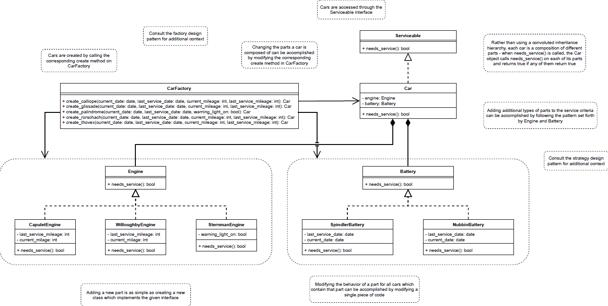

# lyft-backend-intern

**These tasks focus on :**

* Back-end logic
* Database management
* Application program interfaces (APIs)
* Architecture
* Servers

## Task 1

Developing a component that is used by the rental fleet’s new logistics system

1. #### **Identify Classes and Relationships:**

   **Car:** The Car class would be central to the system. Each car instance would have associations with its respective Engine, Battery, and Tire (the new component to consider).

   **Engine, Battery, Tire:** These would be abstract classes, with subclasses for each specific type (e.g., CapuletEngine, WilloughbyEngine, SpindlerBattery, NubbinBattery, etc.). The specific service criteria would be defined within these subclasses.

   **ServiceCriteria:** This could be an interface or an abstract class that defines the methods necessary for determining if a service is required. Each subclass of Engine, Battery, and Tire would implement or extend ServiceCriteria.
2. #### **Apply Design Principles:**

   **Composition:** Favor composition over inheritance by having the `Car` class composed of `Engine`, `Battery`, and `Tire` objects rather than inheriting from them. This adheres to the principle of composition over inheritance and allows for greater flexibility in mixing and matching parts.

   **Encapsulation:** Enclose the service determination logic within the respective ` Engine`, `Battery`, and `Tire` subclasses to keep the design clean and modular.

   **Single Responsibility Principle:** Ensure that each class has a single responsibility.
3. #### **Consider Future Extensibility:**

   **Flexible Service Criteria:** Make sure it's easy to add new service criteria or modify existing criteria by encapsulating this logic within the ServiceCriteria interface or abstract class.
   **Easy Part Substitution:** Design the Car class so that it's straightforward to change the Engine, Battery, or Tire for a car instance. This will cater to the requirement of changing which parts each car model includes.
4. #### **Draft the UML Diagram:**
